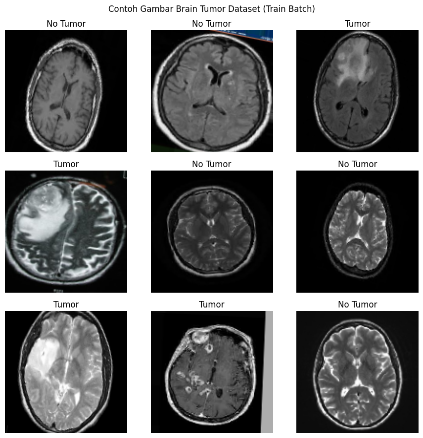
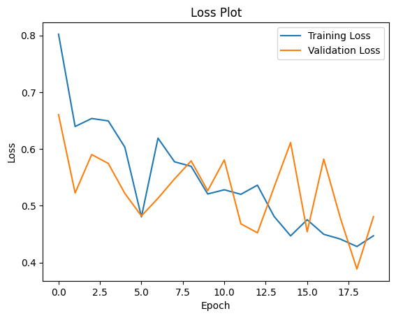
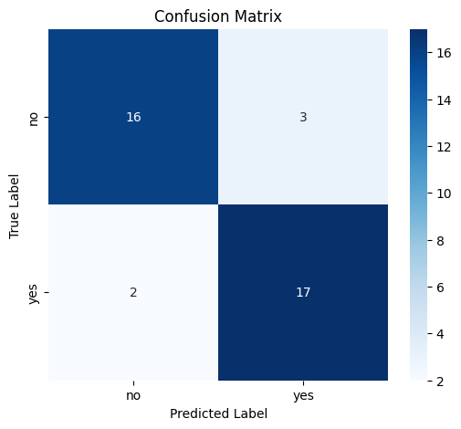
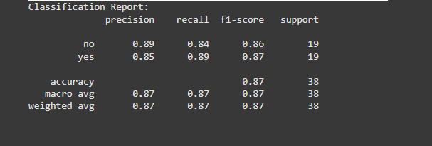
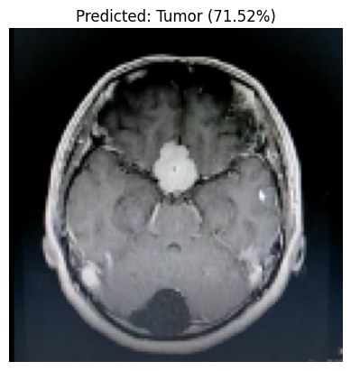

# Klasifikasi Tumor Otak menggunakan CNN

## 💡 Ringkasan Proyek

Proyek ini membangun model **Convolutional Neural Network (CNN)** untuk melakukan **klasifikasi otomatis** gambar MRI otak menjadi dua kelas: **Tumor** dan **Tidak Ada Tumor**. Model dilatih menggunakan dataset gambar MRI yang telah dilabeli dan dievaluasi secara menyeluruh.

Fitur utama proyek ini:

* Training dan evaluasi model CNN.
* Visualisasi proses training.
* Evaluasi performa menggunakan confusion matrix dan classification report.
* Inferensi (prediksi) gambar baru.

## 🎓 Tujuan Pembelajaran

Memahami dan menerapkan **arsitektur CNN** untuk menyelesaikan problem **klasifikasi gambar biner**, serta mengevaluasi performa model pada data yang belum pernah dilihat sebelumnya.

---

## 📊 Teknologi yang Digunakan

* **Python** 3.x
* **TensorFlow / Keras** - framework deep learning dan pembuatan model.
* **OpenCV (cv2)** - preprocessing gambar.
* **Matplotlib** & **Seaborn** - visualisasi data dan hasil.
* **scikit-learn** - evaluasi model (confusion matrix & classification report).

---

## 📅 Persiapan Dataset

* Struktur folder:

```
brain_tumor_dataset/
    yes/    # gambar MRI dengan tumor
    no/     # gambar MRI tanpa tumor
```

* Total gambar: \~196 (98 per kelas)



* Augmentasi gambar menggunakan **ImageDataGenerator**:

  * Rotasi
  * Zoom
  * Shear
  * Horizontal flip

* Sumber dataset: [Brain MRI Images for Brain Tumor Detection](https://www.kaggle.com/datasets/navoneel/brain-mri-images-for-brain-tumor-detection) - by Navoneel Chakrabarty (Kaggle)

---

## 👤 Arsitektur Model CNN

| Layer Type   | Parameter                |
| ------------ | ------------------------ |
| Conv2D       | (32 filter, 3x3) + ReLU  |
| MaxPooling2D | 2x2                      |
| Conv2D       | (64 filter, 3x3) + ReLU  |
| MaxPooling2D | 2x2                      |
| Conv2D       | (128 filter, 3x3) + ReLU |
| MaxPooling2D | 2x2                      |
| Flatten      | -                        |
| Dense        | 128 neuron + ReLU        |
| Dropout      | 0.5                      |
| Dense        | 1 neuron + Sigmoid       |

* Optimizer: `Adam`
* Loss: `Binary Crossentropy`
* Metrics: `Accuracy`

### Callbacks:

* **EarlyStopping**: monitor `val_loss`, patience 10.
* **ModelCheckpoint**: simpan model terbaik berdasarkan `val_accuracy`.

---

## 📈 Hasil Training

### Grafik Akurasi:


### Grafik Loss:



* Akurasi validasi akhir: **\~84%**
* Model menunjukkan generalisasi yang baik tanpa overfitting yang signifikan.

---

## 📊 Evaluasi Model

### Confusion Matrix:



### Classification Report:



* **Precision**: 0.85 - 0.89
* **Recall**: 0.84 - 0.89
* **F1-Score**: \~0.87

Model mampu melakukan prediksi yang cukup akurat dan seimbang untuk kedua kelas.

---

## 🔢 Penjelasan Kode

### Data Generator:

```python
ImageDataGenerator(
    rescale=1./255,
    rotation_range=20,
    zoom_range=0.2,
    shear_range=0.1,
    horizontal_flip=True,
    validation_split=0.2
)
```

* Augmentasi dan normalisasi gambar otomatis.

### Pembuatan Model:

```python
Sequential([
    Conv2D(32, (3,3), activation='relu', input_shape=(128,128,3)),
    MaxPooling2D(2,2),
    Conv2D(64, (3,3), activation='relu'),
    MaxPooling2D(2,2),
    Conv2D(128, (3,3), activation='relu'),
    MaxPooling2D(2,2),
    Flatten(),
    Dense(128, activation='relu'),
    Dropout(0.5),
    Dense(1, activation='sigmoid')
])
```

### Callbacks:

```python
EarlyStopping(monitor='val_loss', patience=10, restore_best_weights=True)
ModelCheckpoint('best-brain-tumor-model.h5', monitor='val_accuracy', save_best_only=True)
```

### Penyimpanan Model:

```python
model.save('/content/drive/MyDrive/brain-tumor-model/final-brain-tumor-model.h5')
```

---

## 🔧 Inferensi (Prediksi) Gambar Baru

### Fungsi `load_and_predict()`:

```python
def load_and_predict(img_path, model_path='final-brain-tumor-model.h5'):
    # Load model, preprocessing gambar, prediksi
    # Tampilkan gambar + label + confidence
```

* Digunakan untuk menguji model dengan **gambar baru dari luar dataset**.

### Contoh Output:


* Model berhasil memprediksi gambar sebagai **Tumor** dengan confidence \~71%.

---

## 📖 Cara Menggunakan Proyek Ini

### 1. Clone Repository

```bash
git clone https://github.com/your_username/brain-tumor-classification.git
cd brain-tumor-classification
```

### 2. Install Dependencies

```bash
pip install tensorflow opencv-python matplotlib seaborn scikit-learn
```

### 3. Jalankan Notebook

* Buka `CNN_Brain_tumor_classification.ipynb` di **Google Colab**.
* Ikuti langkah-langkah dalam notebook:

  * Siapkan dataset
  * Lakukan training
  * Evaluasi model
  * Uji gambar baru

### 4. Uji Gambar Baru

```python
load_and_predict('nama_file_gambar.jpg')
```

---

## 🎉 Kesimpulan

Proyek ini membuktikan bahwa dengan arsitektur CNN yang relatif sederhana, kita dapat membangun model yang cukup akurat untuk mendeteksi keberadaan tumor otak dari gambar MRI. Dengan akurasi validasi mencapai \~84% dan skor F1 yang seimbang di kedua kelas, model ini cukup layak untuk aplikasi awal.

Pengembangan ke depan yang bisa dilakukan:

* Menerapkan **Transfer Learning** (pretrained model).
* Menambah ukuran dan variasi dataset.
* Melakukan tuning hyperparameter untuk meningkatkan performa.

---
